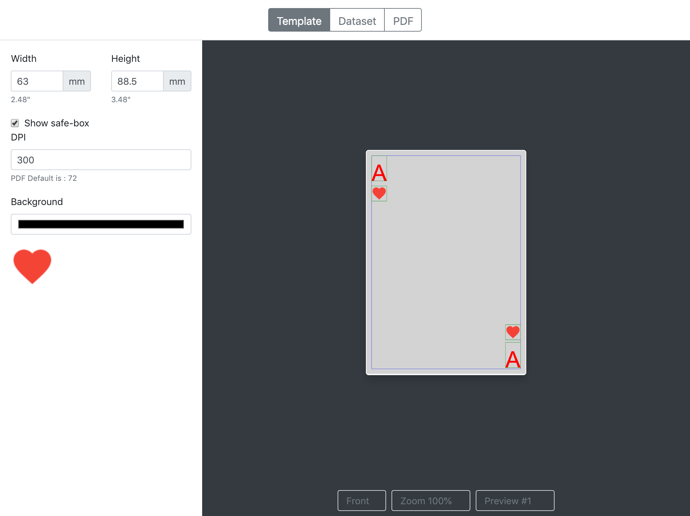

# CardMaker

Create your own decks or download from the public directory. Print and play!

## Features

- Create double sides ready for print pdf files, Print, cut, sleeve and play.
- Download decks from public directory.

## How to use

Visit [cardmaker.cgeosoft.com](https://cardmaker.cgeosoft.com) and create a new project. If you have previously saved one, select to load from file or from any of your online storages.

Every project has templates and datasets. Templates are definitions of the card layout, and the external assets that may include. The datasets are the values for each card. Combine one of each to generate a printable PDF.

You may search the directory for example projects and request your own to be published.

## Technical specs

Project

| Property    | Description                                                                                                     |
| ----------- | --------------------------------------------------------------------------------------------------------------- |
| Name        | The friendly name for easy recognise the project. Ex. `Monsters United Draft#1`                                 |
| Description | A short description of the project. Include one if you plan to publish your project for other to easily find it |

Template

| Property              | Description                                                          |
| --------------------- | -------------------------------------------------------------------- |
| Name                  | The friendly name for easy recognise the project. Ex. `common cards` |
| Size                  | Width and height of the card in mm                                   |
| Front                 | The layout of front side                                             |
| Layouts.Front.Padding |                                                                      |
| Back                  | The layout of back side                                              |
|                       |                                                                      |

Layout

Padding:|the gap that will leave around the edges in mm
Elements|elements or other layouts

Elements

Name
Top
Right
Width
Height

Element Image

Image: the URL or base64 image
Style: crop, fit, original

Element text

Text
Alignment
Font family
Font size
Font colour
Autosize
